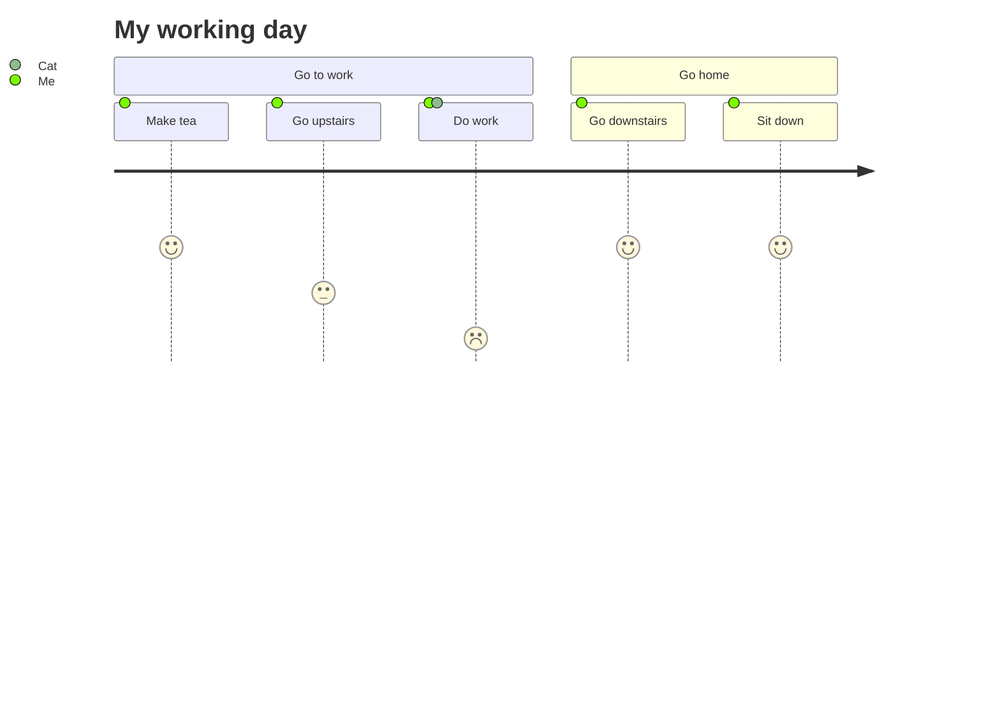
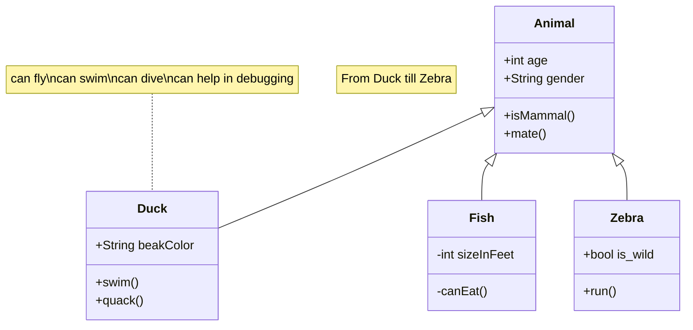
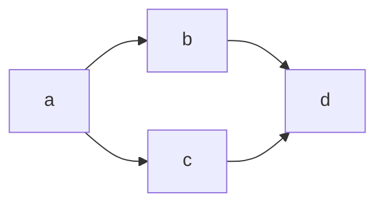
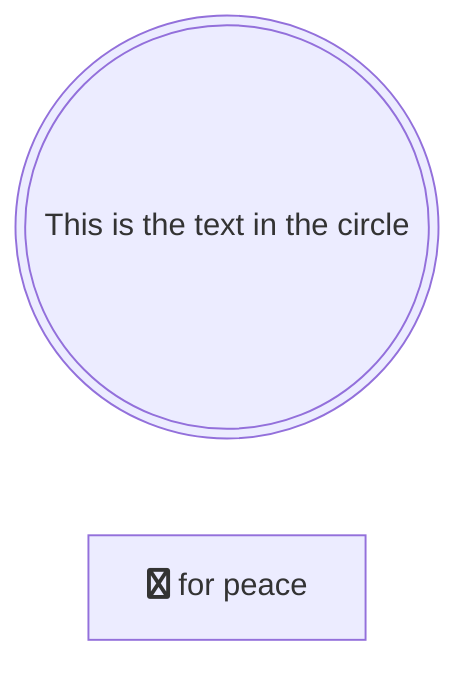
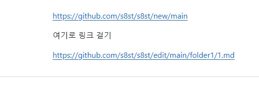

```mermaid

flowchart TD
    B(("fa:fa-twitter 🥇for peace"))
    B-.->|😲글자추가|C[fa:fa-ban forbidden]
    B-->D(fa:fa-spinner)
    B-->E(A fa:fa-camera-retro perhaps?)

```

<link  href="https://cdnjs.cloudflare.com/ajax/libs/font-awesome/6.5.1/css/all.min.css"  rel="stylesheet" />  

### Hi there 👋
# 1234567890
## ⚒  Under Construction 🛠


<!-- 주석 -->

<!--
**s8st/s8st** is a ✨ _special_ ✨ repository because its `README.md` (this file) appears on your GitHub profile.

Here are some ideas to get you started:

- 🔭 I’m currently working on ...
- 🌱 I’m currently learning ...
- 👯 I’m looking to collaborate on ...
- 🤔 I’m looking for help with ...
- 💬 Ask me about ...
- 📫 How to reach me: ...
- 😄 Pronouns: ...
- ⚡ Fun fact: ...
[](링크 연결 주소)
-->  
---  

아바타이미지  ---> 주소 끝에 `.png` 추가  


`ctrl` + `shift` + `p` == change preview

```diff
-rkskekfkakqktk
+가나다라마바사
```
````
```diff
-rkskekfkakqktk
+가나다라마바사
```
````


---  

https://shields.io/  


```

```

   

https://www.youtube.com/watch?v=ApzXTlqATVI  


```
<svg role="img" viewBox="0 0 24 24" xmlns="http://www.w3.org/2000/svg"><title>C#</title><path d="M1.194 7.543v8.913c0 1.103.588 2.122 1.544 2.674l7.718 4.456a3.086 3.086 0 0 0 3.088 0l7.718-4.456a3.087 3.087 0 0 0 1.544-2.674V7.543a3.084 3.084 0 0 0-1.544-2.673L13.544.414a3.086 3.086 0 0 0-3.088 0L2.738 4.87a3.085 3.085 0 0 0-1.544 2.673Zm5.403 2.914v3.087a.77.77 0 0 0 .772.772.773.773 0 0 0 .772-.772.773.773 0 0 1 1.317-.546.775.775 0 0 1 .226.546 2.314 2.314 0 1 1-4.631 0v-3.087c0-.615.244-1.203.679-1.637a2.312 2.312 0 0 1 3.274 0c.434.434.678 1.023.678 1.637a.769.769 0 0 1-.226.545.767.767 0 0 1-1.091 0 .77.77 0 0 1-.226-.545.77.77 0 0 0-.772-.772.771.771 0 0 0-.772.772Zm12.35 3.087a.77.77 0 0 1-.772.772h-.772v.772a.773.773 0 0 1-1.544 0v-.772h-1.544v.772a.773.773 0 0 1-1.317.546.775.775 0 0 1-.226-.546v-.772H12a.771.771 0 1 1 0-1.544h.772v-1.543H12a.77.77 0 1 1 0-1.544h.772v-.772a.773.773 0 0 1 1.317-.546.775.775 0 0 1 .226.546v.772h1.544v-.772a.773.773 0 0 1 1.544 0v.772h.772a.772.772 0 0 1 0 1.544h-.772v1.543h.772a.776.776 0 0 1 .772.772Zm-3.088-2.315h-1.544v1.543h1.544v-1.543Z"/></svg>
```

---  

https://simpleicons.org/  


https://hits.seeyoufarm.com/

<a href="https://hits.seeyoufarm.com"></a> ---> **Html**  
[](https://hits.seeyoufarm.com) ---> **Markdown** 

[](https://hits.seeyoufarm.com) ---> 

```html
<a href="https://hits.seeyoufarm.com">
</a>  

[](https://hits.seeyoufarm.com)

```

<svg width="98" height="96" xmlns="http://www.w3.org/2000/svg"><path fill-rule="evenodd" clip-rule="evenodd" d="M48.854 0C21.839 0 0 22 0 49.217c0 21.756 13.993 40.172 33.405 46.69 2.427.49 3.316-1.059 3.316-2.362 0-1.141-.08-5.052-.08-9.127-13.59 2.934-16.42-5.867-16.42-5.867-2.184-5.704-5.42-7.17-5.42-7.17-4.448-3.015.324-3.015.324-3.015 4.934.326 7.523 5.052 7.523 5.052 4.367 7.496 11.404 5.378 14.235 4.074.404-3.178 1.699-5.378 3.074-6.6-10.839-1.141-22.243-5.378-22.243-24.283 0-5.378 1.94-9.778 5.014-13.2-.485-1.222-2.184-6.275.486-13.038 0 0 4.125-1.304 13.426 5.052a46.97 46.97 0 0 1 12.214-1.63c4.125 0 8.33.571 12.213 1.63 9.302-6.356 13.427-5.052 13.427-5.052 2.67 6.763.97 11.816.485 13.038 3.155 3.422 5.015 7.822 5.015 13.2 0 18.905-11.404 23.06-22.324 24.283 1.78 1.548 3.316 4.481 3.316 9.126 0 6.6-.08 11.897-.08 13.526 0 1.304.89 2.853 3.316 2.364 19.412-6.52 33.405-24.935 33.405-46.691C97.707 22 75.788 0 48.854 0z" fill="#24292f"/></svg>


<svg width="98" height="96" xmlns="http://www.w3.org/2000/svg"><path fill-rule="evenodd" clip-rule="evenodd" d="M48.854 0C21.839 0 0 22 0 49.217c0 21.756 13.993 40.172 33.405 46.69 2.427.49 3.316-1.059 3.316-2.362 0-1.141-.08-5.052-.08-9.127-13.59 2.934-16.42-5.867-16.42-5.867-2.184-5.704-5.42-7.17-5.42-7.17-4.448-3.015.324-3.015.324-3.015 4.934.326 7.523 5.052 7.523 5.052 4.367 7.496 11.404 5.378 14.235 4.074.404-3.178 1.699-5.378 3.074-6.6-10.839-1.141-22.243-5.378-22.243-24.283 0-5.378 1.94-9.778 5.014-13.2-.485-1.222-2.184-6.275.486-13.038 0 0 4.125-1.304 13.426 5.052a46.97 46.97 0 0 1 12.214-1.63c4.125 0 8.33.571 12.213 1.63 9.302-6.356 13.427-5.052 13.427-5.052 2.67 6.763.97 11.816.485 13.038 3.155 3.422 5.015 7.822 5.015 13.2 0 18.905-11.404 23.06-22.324 24.283 1.78 1.548 3.316 4.481 3.316 9.126 0 6.6-.08 11.897-.08 13.526 0 1.304.89 2.853 3.316 2.364 19.412-6.52 33.405-24.935 33.405-46.691C97.707 22 75.788 0 48.854 0z" fill="#fff"/></svg>


---  

git


---  
## 빌드 후 수정 사항이 생기면 빌드를 다시 해야하는 문제점 해결 :
> [!IMPORTANT]
> `에셋번들 & 어드레서블`  
> `Assetbundle & Addressable`

---   


게임 개발 종합반 5강
| 주차 | webGL 주소 |  추가 계획 |
|:---------:|:---------:|:---------:|
|1.rain|||
|2.MyShield|[](https://s8st.github.io/20240325MyShield/)|포톤 멀티플레이<br>쉴드 크기 커지는 아이템,작아지는 아이템,가로 세로 수정, 이미지 변경|
|3.|||
|4.|||
|5.|||


--- 
# 최종프로젝트  
https://github.com/s8st/20240320FinalProject


---  


---  
> [!CAUTION]
> 붉은색 인용

---  


---  

이미지 업로드 테스트
   


`/20240320FinalProject/assets/` ---> 이미지를 드래그엔드랍하면 숨겨진 폴더에 이미지가 저장되고 이미지가 숨겨진 주소를 참고하는 것 같다.  
**readme를 vscode에서 작성하면 이미지가 따로 업로드 된다.**

```
https://github.com/s8st/20240320FinalProject/assets/153998744/bcaeedf0-3753-44ac-8cc7-01e7526a1512
```


---  
유니티 학습 튜토리얼
https://learn.unity.com/u/62656e2cedbc2a3190f0c403
---  


---

[](https://s8st.github.io/20240314TopDown/)

```

[](링크 연결 주소)

[](https://s8st.github.io/20240314TopDown/)

```


---  



````

````


---  

|mermaid 종류|코드|모양|
|---|---|---|
|Sequence diagrams|||
|flowchart|```` ```mermaid flowchart LR   a --> b & c--> d  ```  ````|  ```mermaid<br>flowchart LR<br>a --> b & c--> d <br>``` |








---  
```mermaid

flowchart LR
    0307링크테스트 --> 0314링크테스트
    B-->C
   
    click 0307링크테스트 "https://github.com/s8st/pong0307" _blank
    click 0314링크테스트 "https://github.com/s8st/20240314TopDown" "Open this in a new tab" _blank
    click C href "https://www.github.com" _blank
    click D href "https://www.github.com" "Open this in a new tab" _blank

```

````
```mermaid

flowchart LR
    A-->B
    B-->C
    C-->D
    D-->E
    click A "https://www.github.com" _blank
    click B "https://www.github.com" "Open this in a new tab" _blank
    click C href "https://www.github.com" _blank
    click D href "https://www.github.com" "Open this in a new tab" _blank

```````


---  

```mermaid
flowchart LR
    A:::foo & B:::bar --> C:::foobar
    classDef foo stroke:#f00
    classDef bar stroke:#0f0
    classDef foobar stroke:#00f
```


---  

```
<div class="fa-3x">
  <i class="fa-solid fa-circle-plus fa-beat"></i>
  <i class="fa-solid fa-heart fa-beat"></i>
  <i class="fa-solid fa-heart fa-beat" style="--fa-animation-duration: 0.5s;"></i>
  <i class="fa-solid fa-heart fa-beat" style="--fa-animation-duration: 2s;"></i>
  <i class="fa-solid fa-heart fa-beat" style="--fa-beat-scale: 2.0;"></i>
</div>
```





---  


::icon(mdi mdi-skull-outline)  
:icon(mdi mdi-skull-outline)  
::icon(fa fa-book)


[](🥇)


The background color is `#ffffff` for light mode and `#000000` for dark mode.


<details>

 <summary>Tips for collapsed sections</summary>

### You can add a header

You can add text within a collapsed section. 

You can add an image or a code block, too.

```ruby
   puts "Hello World"
```

</details>

---  


````
<details>

<summary>Tips for collapsed sections</summary>

### You can add a header

You can add text within a collapsed section. 

You can add an image or a code block, too.

```ruby
   puts "Hello World"
```

</details>
````


---   


---  
> `들여쓰기`
?

mermaid문법 : 
> https://www.youtube.com/watch?v=NM53Cxn2P-w  
> https://www.youtube.com/watch?v=tfKFbYXcF1w
  
  
Here is a simple flow chart:


https://docs.github.com/en/get-started/writing-on-github/working-with-advanced-formatting/creating-diagrams#creating-mermaid-diagrams
````
Here is a simple flow chart:

```mermaid
graph TD;  %% TD : topdown, LR : left right%%
    A-->B;
    A-->C;
    B-->D;
    C-->D;
```
````


# 💣  `:bomb`

<span style="color:red">

빨강 글씨

Red Font

</span>

---  


$\alpha\$  
$\beta$  == `$\beta$  `  
$\vec{A}$  == `$\vec{A}$`      

```LaTex
$\alpha\$
$\beta$
$\vec{A}$ 
```

---  
<span style ="background-color : red"> 테이블과 그림 </span>  
<span style ="font-size:50px"> 테이블과 그림 </span>  
<p style="font-size:50px"> 테이블과 그림 </p>  

<p style="color:orange"> 테이블과 그림 </p>

```html
<span style ="background-color : red"> 테이블과 그림 </span>  
<span style ="font-size:50px"> 테이블과 그림 </span>  
<p style="font-size:50px"> 테이블과 그림 </p>  

<p style="color:orange"> 테이블과 그림 </p>

```
  


https://www.youtube.com/watch?v=mTBNQ3ag7Dw  
https://www.youtube.com/watch?v=a10E3lZE36U  
https://www.youtube.com/watch?v=Yz8obC1DdVw  

---  

[#링크테스트 : 절대경로](https://github.com/s8st/s8st/blob/main/folder1/1.md#여기로-링크-걸기)  

[#링크테스트 : 상대경로](folder1/1.md#여기로-링크-걸기)  

---


절대경로: 

  


상대경로 :  

  

와... 된다..


```

[#링크테스트 : 절대경로](https://github.com/s8st/s8st/blob/main/folder1/1.md#여기로-링크-걸기)  

[#링크테스트 : 상대경로](folder1/1.md#여기로-링크-걸기)


절대경로: 
  


상대경로 :  
  

```


---
---   

# 🍀 
## 🍀 
🍀 

# 🥰  
:s  
<kbd> : </kbd> + <kbd> s </kbd>  
<kbd> : </kbd> + <kbd> 알파벳 </kbd>  
  


키보드모양
```
<kbd>  </kbd>
```


---

  
***delegate***  


https://www.youtube.com/watch?v=7H3MHXfFkhI

---
https://www.csharpstudy.com/  
https://www.w3schools.com/cs/index.php  
https://www.youtube.com/watch?v=b8YUfee_pzc  

---


```
// 게임 캐릭터 클래스
class GameCharacter
{
    private Action<float> healthChangedCallback;

    private float health;

    public float Health
    {
        get { return health; }
        set
        {
            health = value;
            healthChangedCallback?.Invoke(health);
        }
    }

    public void SetHealthChangedCallback(Action<float> callback)
    {
        healthChangedCallback = callback;
    }
}

// 게임 캐릭터 생성 및 상태 변경 감지
GameCharacter character = new GameCharacter();
character.SetHealthChangedCallback(health =>
{
    if (health <= 0)
    {
        Console.WriteLine("캐릭터 사망!");
    }
});

// 캐릭터의 체력 변경
character.Health = 0;

```


---

```c#
// 아이템을 사용할 수 있는 인터페이스
public interface IUsable
{
    void Use();
}

// 아이템 클래스
public class Item : IUsable
{
    public string Name { get; set; }

    public void Use()
    {
        Console.WriteLine("아이템 {0}을 사용했습니다.", Name);
    }
}

// 플레이어 클래스
public class Player
{
    public void UseItem(IUsable item)
    {
        item.Use();
    }
}

// 게임 실행
static void Main()
{
    Player player = new Player();
    Item item = new Item { Name = "Health Potion" };
    player.UseItem(item);
}
```


---
webp는 지원안됨  


WebM 테스트
923kb

[Honeycam 2024-03-11 23-53-04.webm](https://github.com/s8st/s8st/assets/153998744/9425e2ca-d41c-4b2e-abbf-98cdb367537d)


---


---
어떤 웹브라우저가 기본적으로 WebP를 지원하나요?  
사이트 성능을 개선하는 데 관심이 있는 웹마스터는 현재 이미지에 최적화된 WebP 대체 버전을 쉽게 만들어 WebP를 지원하는 브라우저에 타겟팅된 방식으로 제공할 수 있습니다.  


WebP 손실 지원  
Chrome (데스크톱) 17 이상  
Android용 Chrome 버전 25 이상  
Microsoft Edge 18 이상  
Firefox 65 이상  
Opera 11.10 이상  
기본 웹브라우저, Android 4.0 이상 (ICS)  
Safari 14 이상 (iOS 14 이상, macOS Big Sur+)  
WebP 손실, 무손실 및 알파 지원  
Chrome (데스크톱) 23 이상  
Android용 Chrome 버전 25 이상  
Microsoft Edge 18 이상  
Firefox 65 이상  
Opera 12.10 이상  
기본 웹브라우저, Android 4.2 이상 (JB-MR1)  
페일 문 26 이상  
Safari 14 이상 (iOS 14 이상, macOS Big Sur+)  
WebP 애니메이션 지원  
Chrome (데스크톱 및 Android) 32 이상  
Microsoft Edge 18 이상   
Firefox 65 이상  
Opera 19 이상  
Safari 14 이상 (iOS 14 이상, macOS Big Sur+)  


---
---
```c#

            for (int i = 1; i <= 9; i++)
            {
                for (int j = 2; j <= 9; j++)
                {
                    Console.Write(j + " x " + i + " = " + (i * j)+"\t");
                }
                Console.WriteLine();
            }
```
---


---
```c#
Console.Write("문자를 입력하세요: ");
char input = Console.ReadLine()[0];

if (input >= 'a' && input <= 'z' || input >= 'A' && input <= 'Z')
{
    Console.WriteLine("알파벳입니다.");
}
else
{
    Console.WriteLine("알파벳이 아닙니다.");
}

```


---
https://www.youtube.com/watch?v=dUbp9wAy178


---


|날짜|제목|?|?|
|--|--|--|--|
|20240308|[pong만들기](https://github.com/s8st/pong0307/tree/main)|  | |
|20240308|[TopDown게임만들기](https://github.com/s8st/0308TopDown) | | |
| | | | |


```Html

|날짜|제목| |
|--|--|--|
|20240308|[pong만들기](https://github.com/s8st/pong0307/tree/main)| |
| 계속 추가| | |
```


---
[하단의 What is Lorem Ipsum?로 이동](https://github.com/s8st#what-is-lorem-ipsum)  

[하단의 What is Lorem Ipsum?로 이동](#what-is-lorem-ipsum)

[맨 처음으로 이동?](#)

[링크 테스트](#0222gifgif)  

```
[링크 테스트](#0222gifgif)
 하단에 있는 0222gif.gif 바로 가는 링크

[하단의 What is Lorem Ipsum?로 이동](https://github.com/s8st#what-is-lorem-ipsum)
[하단의 What is Lorem Ipsum?로 이동](#what-is-lorem-ipsum)

0222gif.gif  --->  #0222gifgif

- 문단의 첫 문자열 앞에 # 붙이기
- 문자열의 공백은 - 로 바꾸기 
- 특수문자 : 모두 삭제
- 소문자로 작성

<a href="#" class="btn--success">Success Button</a>
[Button](#){: .btn .btn--primary }

```

[여기를 링크로 가보자](#여기를-링크로-가보자)

<a href="#" class="btn--success">Success Button</a>  

[Button](#)


---


   
> <kbd> 글자색, 밑줄 등은 안되네??</kbd>

글자색 바꾸기  


<span style="color:yellow">노란 글씨입니다.</span>  


<span style="color:red">red 글씨입니다.</span>  


```html
<span style="color:yellow">노란 글씨입니다.</span>
```
---

<u>밑줄 있는 텍스트입니다</u>

```
<u>밑줄 있는 텍스트입니다</u>
```

---


<details>
<summary>토글 방식으로 접고 펼치는 방법 </summary>
<div markdown="1">

위의 ▶ 삼각형을 누르면 토글로 접고 펼칠 수 있다.

</div>
</details>

```html
<details>
<summary>토글 방식으로 접고 펼치는 방법 </summary>
<div markdown="1">

위의 ▶ 삼각형을 누르면 토글로 접고 펼칠 수 있다.

 //div markdown="1" 작성은 필수

</div>
</details>
```


---

링크 테스트 [s8st.github.io/test1.md](s8st.github.io/test1.md)

링크테스트[https://github.com/s8st/s8st.github.io/tree/main/test1.md](https://github.com/s8st/s8st.github.io/tree/main/test1.md)


https://s8st.github.io/test1.md
---
[절대 주소로 연결:https://s8st.github.io/20240304.md](https://s8st.github.io/20240304.md)

상대 주소로 연결하려면???
깃허브 프로파일 페이지 : https://github.com/s8st

깃허브 웹 페이지 : https://s8st.github.io/
주소가 아예 다른 것 같다..

https://github.com/s8st/s8st.github.io/tree/main/test1.md


---
동영상 업로드 테스트 : 10mb제한. 영상 드래그엔드롭하면 자동으로 플레이 가능상태로 삽입됨


https://github.com/s8st/s8st/assets/153998744/145ff253-3f52-4336-9f90-abe1decf03a7


---
---
---
---


<kbd>win</kbd> + <kbd>**.**</kbd>   =>  윈도우 이모지


---
===
가나다라 주석[^1].

[^1]: 윈도우 이모티콘 단축키.
===
---

> [!]
> >
---
> [!NOTE]
> >

> [!TIP]
> >
---

> [!IMPORTANT]
> Key information users need to know to achieve their goal.

> [!WARNING]
> Urgent info that needs immediate user attention to avoid problems.

> [!CAUTION]
> Advises about risks or negative outcomes of certain actions.
---


https://github.com/ikatyang/emoji-cheat-sheet/blob/master/README.md#animals--nature

:snail:
> :snail: == `:snail:`


- [x] 선택
- [ ] ㄱ
- [ ] ㄴ

`rgb(9, 105, 218)`

The background color is `#ffffff` for light mode and `#000000` for dark mode.

`rgb(255,0,0)`r

>>rgb(255,0,0)


**가나다라**

```c#
if(Live)
{
  ToLove();
}
```
> ←  >

```
> ㅁ
```
|제목|제목|
|--|--|
|가|나|


https://getsharex.com


강인 튜터님 추천 :
https://shlifedev.gitbook.io/unitygooglesheets/

https://i.imgur.com/otyeSQJ.gif

[](https://youtu.be/'rb52LNPOwo0')

[https://www.youtube.com/watch?v=rb52LNPOwo0]
---

<iframe width="1280" height="720" src="https://www.youtube.com/embed/rb52LNPOwo0" title="이문세 노래모음 26곡, 보고듣는 소울뮤직TV" frameborder="0" allow="accelerometer; autoplay; clipboard-write; encrypted-media; gyroscope; picture-in-picture; web-share" allowfullscreen></iframe>
---


https://youtu.be/rb52LNPOwo0?si=ZHRUOTeFMyH8NWsO


netpong test : https://s8st.github.io/netpong2_off_falback/


gif 연결이 안되네...

https://s8st.github.io/netpong2_off_falback/0222gif.gif

https://github.com/s8st/netpong2_off_falback/blob/main/0222gif.gif


0222gif.gif
---
---
<picture>
  <source media="(prefers-color-scheme: dark)" srcset="https://user-images.githubusercontent.com/25423296/163456776-7f95b81a-f1ed-45f7-b7ab-8fa810d529fa.png">
  <source media="(prefers-color-scheme: light)" srcset="https://user-images.githubusercontent.com/25423296/163456779-a8556205-d0a5-45e2-ac17-42d089e3c3f8.png">
  
</picture>

---
---
)
---
---
)
---
---
이건 된다 gif


---
<picture>
 <source media="(prefers-color-scheme: dark)" srcset="YOUR-DARKMODE-IMAGE">
 <source media="(prefers-color-scheme: light)" srcset="YOUR-LIGHTMODE-IMAGE">
 
</picture>
---

- 유니티에서 마우스포인터가 있는 부분에서 shift + spacebar누르면 전체화면이 됩니다
- 윈도우키 +shift + s : 윈도우 기본 스샷
- 듀얼모니터 사용시 창 좌우로 이동 : shift + 윈도우키 +  ←→ (좌,우 방향키)
- 특수키 확장 : 한글 자음 + 한자 +tab키 예시) ㅁ+한자키 누르면 특수키 나오는데 tab키누르면 확장
- 유니티에서 (Alt + Shift + a): 하이어라키에서 객체들 SetAtive toggle 보이게 -- 안보이게
- 유니티에서 ctrl + shift + a :  인스펙터에서 Add Component
- 빈 게임오젝트만들기 단축키(ctrl+shift+n), 자식 빈 게임오브젝트만들기 단축키(alt+shift+n)
    
    
    
- 유니티 단축키 : https://happysalmon.tistory.com/32
- https://blog.naver.com/o_o__eb/222916494209


[9분투자로 노션 초보 탈출해봅시다](https://www.youtube.com/watch?v=UNRjGHUHSQQ)

https://www.youtube.com/watch?v=UNRjGHUHSQQ

[게임업계 상황이 안좋다고 하니 정신을 바짝 차려야 겠네요](https://www.khan.co.kr/opinion/column/article/202402042042005)

https://www.khan.co.kr/opinion/column/article/202402042042005

[6분짜리 깃허브기초강의](https://www.youtube.com/watch?v=Fley6IFhlC8)

[20분짜리 유니티와 깃허브 강의](https://www.youtube.com/watch?v=wBsSUBEUYV4)

[유용한 윈도우 단축키](https://www.youtube.com/shorts/o-MZN35zCTQ)

[유용한 윈도우 단축키2](https://www.youtube.com/watch?v=kVmdftY_nr0)

[우와~ 깃허브 멋지게 꾸미는 방법](https://www.youtube.com/watch?v=w9DfC2BHGPA)


---
<!-- Heading -->
# Heading 1
## Heading 2
### Heading 3
#### Heading 4
##### Heading 5
###### Heading 6
Paragraph

<!-- Line -->
___

<!-- Text attributes -->
This is the **bold** text and this is the *italic* text and let's do ~~strikethrough~~.

<!-- Quote -->
> Don't forget to code your dream 

<!-- Bullet list -->
Fruits:
ğŸ
🍋

Other fruits:
🍑
ğŸ

<!-- Numbered list -->
Numbers:
1. first
2. second
3. third

<!-- Link -->
Click [Here](http://academy.dream-coding.com/)

<!-- Image -->


<!-- Table -->
|Header|Description|
|:--:|:--:|
|Cell1|Cell2|
|Cell3|Cell4|
|Cell5|Cell6|

<!-- Code -->
To print message in the console, use `console.log('your message')` and ..

```ts
console.log('hello')
```

<!-- PR Description Example -->
# What is Lorem Ipsum?
`Lorem Ipsum` is simply dummy text of the printing and typesetting industry. Lorem Ipsum has been the industry's standard dummy **text ever since the 1500s**, when an unknown printer took a galley of type and scrambled it to make a type specimen book. It has survived not only five centuries, but also the leap into electronic typesetting, remaining essentially unchanged. It was popularised in the 1960s with the release of Letraset sheets containing Lorem Ipsum passages, and more recently with desktop publishing software like Aldus PageMaker including versions of Lorem Ipsum.

```ts
console.log('Hello World!');
```

# 여기를 링크로 가보자

|Feature|Description|
|--|--|
|Feature1|<br>Feature1. Responsive Web Page|
|Feature2|<br>Feature2. Responsive Web Page|

## Before release
- [x] Finish my changes
- [x] Push my commits to GitHub
- [ ] Open a pull request

---

<a href="#" class="btn--success">Success Button</a>  

[Button](#)


